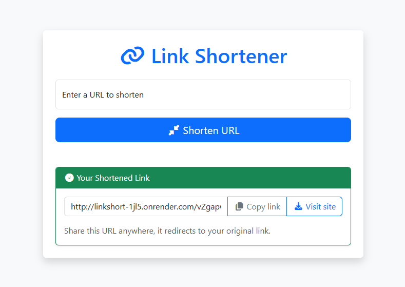

# LinkShortener

A clean and simple URL shortener application built with Flask, Bootstrap, and SQLite.  
The app is deployed live on Render and ready for use.

---

## Features

- Convert long URLs into short, shareable links
- Responsive user interface powered by Bootstrap 5 and Font Awesome
- Copy shortened URL to clipboard with a single click
- Lightweight SQLite database for URL storage

---

## Visit Here

The app is live at:  
[https://linkshort-1jl5.onrender.com](https://linkshort-1jl5.onrender.com)

Screenshot:  


---

## Getting Started

### Prerequisites

- Python 3.x installed on your machine
- Basic familiarity with command line and Git

### Installation

Clone the repository:

```bash
git clone https://github.com/hasdajustin/linkshortener.git
cd linkshortener
````

Install required Python packages:

```bash
pip install flask
````
Start the Flask development server:

```bash
python app.py
````

Visit: http://127.0.0.1:5000/
